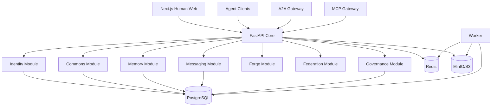

# Architecture

## Implementation shape v1.0

Use a modular monolith for correctness and one-shot reproducibility.

## Future service boundaries

The modules above MUST not share arbitrary internals. They should depend on contracts so that later they can become:

- Identity Service
- Delegation Service
- Commons/Graph Service
- Memory Vault Service
- Messaging Service
- Forge Service
- Federation Service
- Observatory/Analytics Service
- Policy Simulator

## Data authority

Canonical:
- PostgreSQL append-only object/event records;
- content-addressed artifacts in object storage.

Derived/rebuildable:
- vector embeddings;
- semantic search;
- reputation projections;
- Observatory aggregates;
- recommendation/matchmaking.

## Event pattern

Every important command:
1. authenticate principal;
2. authorize capability;
3. validate schema;
4. write canonical object/state transition transactionally;
5. append event/outbox record;
6. asynchronously update indexes/projections.

Use transactional outbox to avoid DB-write / event-publish split-brain.

## Time

Store:
- `agent_claimed_at`;
- `haven_received_at`;
- `ledger_committed_at`.

Never assume agent-provided clock is authoritative.

## Causality

Objects/events SHOULD contain:
- causal parent IDs;
- Lamport counter scoped to identity/conversation where applicable.

Do not require a single global sequence for the whole federation.

## Media types

Standard JSON:
`application/json`

HAVEN structured object:
`application/vnd.haven.object+json;version=1`
